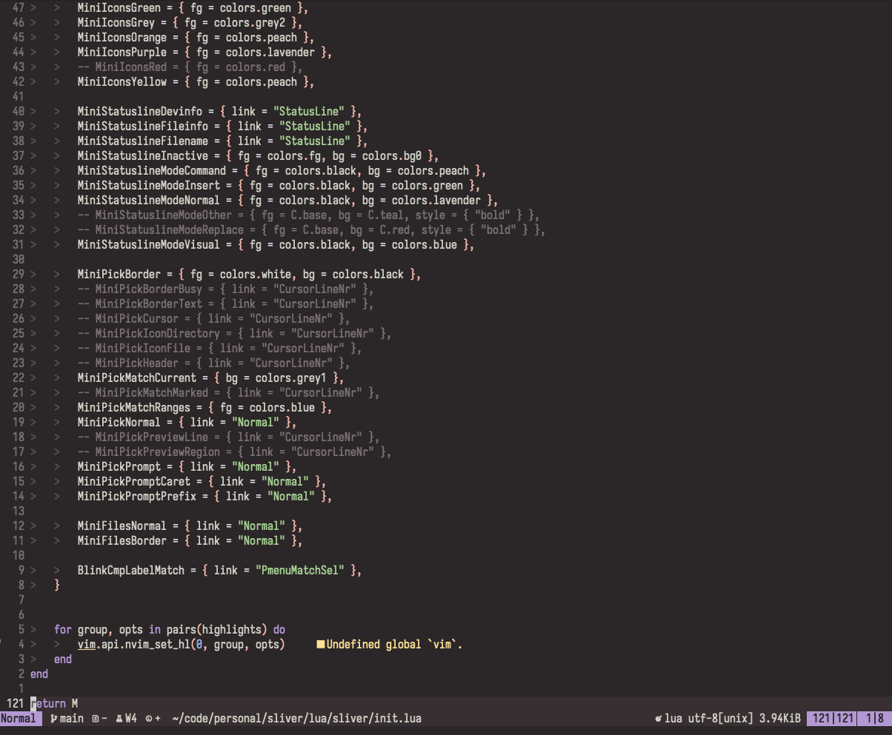

# Sliver

I have several themes that I liked but there's always something that bugged me so I decided to make my own.

The theme is dark only by design and everything is done in a single file so if anyone wants to change something feel free.

PRs are (very) welcomed as long as they follow the simple nature of the theme and design choices.

## Design
- most syntax elements should not be colored (no christmas tree)
- no variants
- warm colors
- low saturation
- no reds except for errors

## Screenshots

